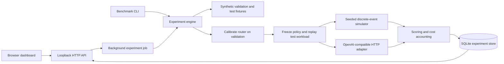

# Architecture and tradeoffs

The engine is independent of HTTP and the dashboard, so the exact same experiment can run from the CLI. Python's standard library keeps setup small and auditable; the browser uses native SVG and DOM APIs with no frontend build step or CDN. Static assets are served from an explicit allowlist. The API validates bounds and types before admitting a job. SQLite writes are transactional.

Each request records expected and observed output, exact-match and per-field scores, schema validity, chosen tier, prompt/completion tokens, billing completeness, service time, queue time, total latency, and error status. Dataset hashes and seed/configuration accompany the result.

The simulator models a client worker pool, not GPU scheduling. Live admission uses a fixed-size thread pool with scheduled arrivals. Pending requests queue, and latency starts at their scheduled arrival, reducing coordinated omission at the client layer. The fixture count is capped at 500, limiting queued work. Provider-internal queueing is included in observed service time but cannot be distinguished without provider metrics.

Threshold candidates are selected using validation data only. Live calibration caches both tiers' responses and replays service times; external load conditions can change during the final test. No production SLO guarantee is inferred from this replay. The baseline and economy policies make the marginal value of routing visible.

Known limitations: template overlap, heuristic aligned with synthetic difficulty, point-estimate constraint selection, fixed live policy order, no cancellation or partial-run checkpoints, no GPU accounting, no adaptive concurrency, no per-model worker pools, and no repeated-trial significance analysis. These are explicit next experiments, not hidden capabilities.
