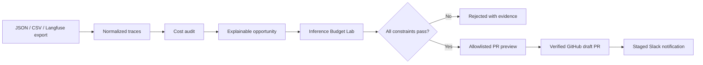

# InferenceOps architecture

The `lab` package remains responsible for simulation, provider calls, load generation, quality scoring, token accounting, and run persistence. The `inferenceops` package adds five boundaries:

1. **Trace boundary:** strict provider-neutral records; optional values remain unknown.
2. **Audit boundary:** deterministic detectors return structured evidence and limitations.
3. **Experiment boundary:** only eligible model-routing findings can invoke automated evaluation.
4. **Workflow boundary:** state transitions and external results are persisted as immutable events.
5. **Connector boundary:** GitHub is restricted to one repository and two paths; Slack is staged by default.

## Failure semantics

External success is never inferred from a request being sent. GitHub must be read back and match the expected branch, draft state, and file set. Missing provider usage invalidates cost verification. A connector failure moves an active workflow to `PARTIAL`; it does not become `COMPLETE`.

## Security boundary

The service binds to loopback, rejects cross-origin mutations, serves static files from an allowlist, and never persists provider keys or Slack webhooks. It is a local portfolio product, not a remotely authenticated multi-tenant service.
